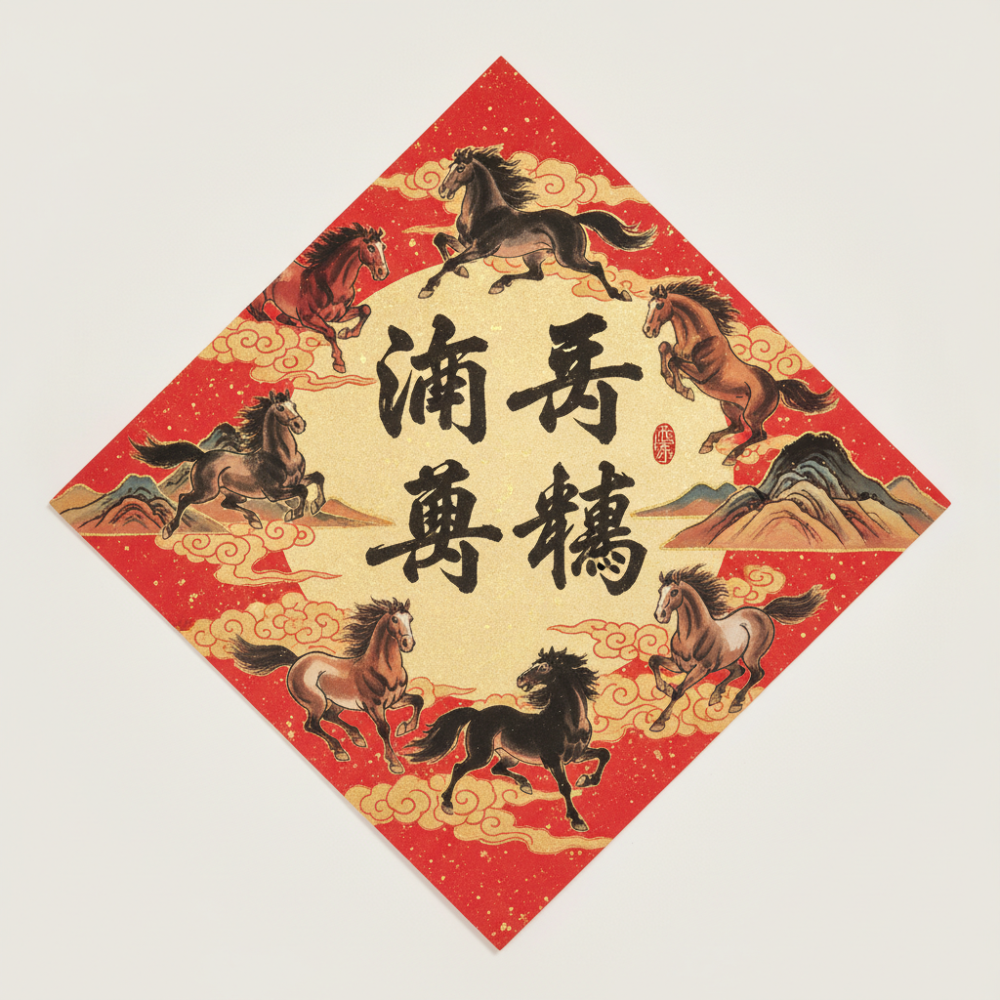
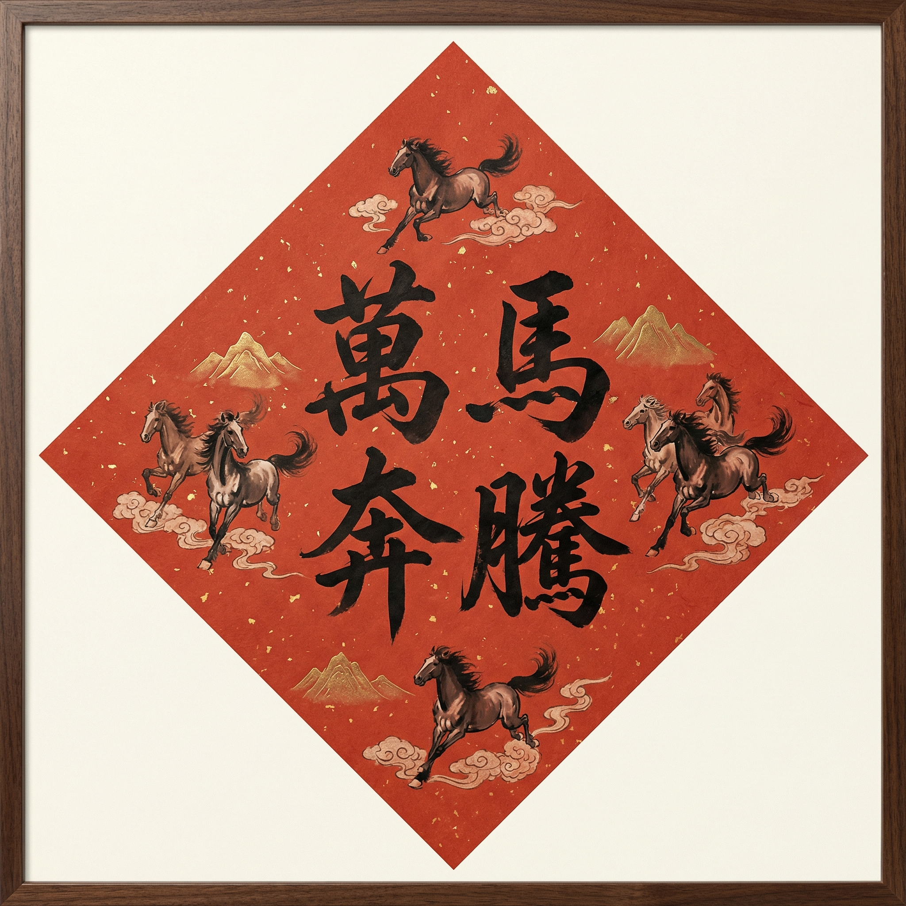

# 春聯斗方大師 (Square Couplets Master)

一個使用 Google Gemini AI 生成傳統春聯斗方藝術作品的應用程式。將您的願望轉化為精美的書法藝術作品。

## ✨ 功能特色

- 🎨 **AI 生成春聯斗方**：輸入關鍵字，自動生成傳統風格的春聯藝術作品
- 🖼️ **參考圖片支持**：上傳參考圖片，AI 會參考其風格生成作品
- 📐 **多種解析度**：支持 1K、2K、4K 解析度輸出
- 🎭 **雙模型選擇**：Gemini 2.5 Flash（快速）和 Gemini 3 Pro（高品質）

## 🚀 快速開始

### 前置需求

- Node.js (建議使用最新 LTS 版本)

### 安裝步驟

1. **安裝依賴套件：**
   ```bash
   npm install
   ```

2. **設置 API Key：**
   - 在 [.env.local](.env.local) 文件中設置 `GEMINI_API_KEY` 為您的 Gemini API key
   - 或者直接在應用程式的設置中輸入 API key

3. **運行應用程式：**
   ```bash
   npm run dev
   ```

4. **打開瀏覽器：**
   - 訪問 `http://localhost:5173`（或終端顯示的地址）

## 🌐 部署到 GitHub Pages

本專案已配置自動部署到 GitHub Pages。當您推送代碼到 `main` 或 `master` 分支時，GitHub Actions 會自動構建並部署應用程式。

### 部署步驟

1. **啟用 GitHub Pages：**
   - 前往 GitHub 倉庫的 Settings
   - 點擊左側的 "Pages"
   - 在 "Source" 部分選擇 "GitHub Actions"

2. **推送代碼：**
   ```bash
   git add .
   git commit -m "Deploy to GitHub Pages"
   git push origin main
   ```

3. **查看部署狀態：**
   - 前往倉庫的 "Actions" 標籤頁
   - 查看部署工作流程的執行狀態

4. **訪問部署的應用：**
   - 部署完成後，應用將在以下地址可用：
   - `https://[您的用戶名].github.io/Square_Couplets_Master/`

### 手動觸發部署

如果需要手動觸發部署，可以：
- 前往 "Actions" 標籤頁
- 選擇 "Deploy to GitHub Pages" 工作流程
- 點擊 "Run workflow" 按鈕

## 💡 使用建議

### ⭐ 推薦使用 Gemini 3 Pro 模型以獲得最佳體驗

**為什麼選擇 Gemini 3 Pro？**

- ✨ **更高品質**：生成的圖片具有更豐富的細節和更精緻的視覺效果
- 🎨 **更好的風格理解**：對參考圖片的風格理解更準確，生成的作品更貼近您的期望
- 📐 **支持高解析度**：支持 2K 和 4K 解析度，適合打印和高品質展示
- 🎯 **更精確的構圖**：對傳統書法和藝術風格的把握更準確

**模型對比：**

| 特性 | Gemini 2.5 Flash | Gemini 3 Pro |
|------|-----------------|--------------|
| 生成速度 | ⚡ 快速 | 🐢 較慢 |
| 圖片品質 | ✅ 良好 | ⭐ 優秀 |
| 解析度支持 | 1K 僅 | 1K / 2K / 4K |
| 風格理解 | ✅ 良好 | ⭐ 優秀 |
| 推薦用途 | 快速測試、迭代 | 最終作品、打印 |

**注意：** Gemini 3 Pro 需要付費 API Key（已啟用帳單）。如果您的 API Key 未啟用帳單，請使用 Gemini 2.5 Flash 模型。

## 🎨 範例作品對比

以下是使用相同關鍵字「萬馬奔騰」生成的範例作品，展示了兩個模型的差異：

### Gemini 2.5 Flash 生成作品

<div align="center">
  
  <p><em>Gemini 2.5 Flash 生成 - 快速生成，品質良好</em></p>
</div>

### Gemini 3 Pro 生成作品

<div align="center">
  
  <p><em>Gemini 3 Pro 生成 - 更高品質，細節豐富</em></p>
</div>

### 對比總結

從以上範例可以看出：

- **Gemini 2.5 Flash**：生成速度快，適合快速測試和迭代，圖片品質良好
- **Gemini 3 Pro**：生成時間較長，但圖片品質明顯提升，細節更豐富，更適合最終作品和打印用途

**建議：** 如果您追求高品質的藝術作品，強烈推薦使用 Gemini 3 Pro 模型。

## 📖 使用說明

1. **輸入關鍵字**：在輸入框中輸入您的願望或祝福語（例如：財富、健康、愛情等）
2. **（可選）上傳參考圖片**：點擊上傳區域選擇一張圖片作為風格參考
3. **選擇模型和解析度**：點擊右上角設置圖標，選擇您偏好的模型和輸出解析度
4. **生成作品**：點擊「Generate」按鈕，等待 AI 生成您的專屬春聯斗方
5. **下載作品**：生成完成後，點擊「Download Artwork」下載您的作品

## 🛠️ 技術棧

- **前端框架**：React 19 + TypeScript
- **樣式**：Tailwind CSS
- **AI 模型**：Google Gemini 2.5 Flash / Gemini 3 Pro
- **構建工具**：Vite

## 📦 NPM 安裝

本專案的 Claude Agent Skills 已發布到 npm，可以通過以下方式安裝：

### 全域安裝 CLI（推薦）

```bash
npm install -g @justin_666/square-couplets-master-skills
```

### 在您的專案中初始化 Skills

安裝後，前往您的專案目錄並初始化 skills：

```bash
# 前往您的專案
cd /path/to/your/project

# 為 Cursor 初始化
doufang init --ai cursor

# 或為 Windsurf 初始化
doufang init --ai windsurf

# 或為 Antigravity 初始化
doufang init --ai antigravity

# 或為 Claude Code 初始化
doufang init --ai claude
```

### 使用 Slash Command

初始化後，在 Cursor / Windsurf / Antigravity 中使用 slash command：

```
/doufang Generate a prompt for wealth theme
/doufang Create a 2K image using Gemini 3 Pro
/doufang Optimize this prompt to reduce white space
```

### CLI 工具命令

安裝後，您還可以使用 `doufang-skills` 命令：

```bash
# 列出所有可用的 skills
doufang-skills list

# 查看特定 skill 的內容
doufang-skills show generate-doufang-prompt

# 獲取 skill 文件路徑（用於程序化訪問）
doufang-skills path generate-doufang-image

# 查看幫助
doufang-skills help
```

### 本地安裝

```bash
npm install @justin_666/square-couplets-master-skills
```

然後在您的專案中使用：

```javascript
import { readFileSync } from 'fs';
import { join } from 'path';

// 獲取 skill 文件路徑
const skillPath = join(require.resolve('@justin_666/square-couplets-master-skills'), '../skills/generate-doufang-prompt/SKILL.md');
const skillContent = readFileSync(skillPath, 'utf-8');
```
<｜tool▁calls▁begin｜><｜tool▁call▁begin｜>
run_terminal_cmd


## 🤖 Claude Agent Skills

本專案包含三個 Claude Agent Skills，可在支援該協定的 AI IDE（如 Cursor）中使用：

### 📝 generate-doufang-prompt
**功能**：根據關鍵字生成專業的春聯斗方藝術作品提示詞

**使用場景**：
- 用戶提供關鍵字或願望短語
- 需要生成傳統中國新年藝術作品提示詞
- 需要將關鍵字轉換為四字祝福語

**示例**：
```
"幫我生成一個關於財富的春聯斗方 prompt"
"為健康長壽主題創建一個 Doufang prompt"
```

### 🎨 generate-doufang-image
**功能**：使用 Google Gemini API 生成實際的春聯斗方藝術作品圖片

**使用場景**：
- 用戶已有提示詞，想要生成實際圖片
- 需要測試不同模型或解析度
- 需要生成帶參考圖片風格的藝術作品

**支持的模型**：
- Gemini 2.5 Flash：快速生成，1K 解析度
- Gemini 3 Pro：高品質，支持 1K/2K/4K 解析度

**示例**：
```
"用 Gemini 3 Pro 生成 2K 解析度的圖片"
"使用這個 prompt 生成圖片，參考圖片風格"
```

### ✨ optimize-doufang-prompt
**功能**：優化 Doufang 提示詞，減少過多留白，改善構圖

**使用場景**：
- 生成的圖片留白過多
- 需要改善提示詞品質
- 生成的圖片構圖不佳
- 需要更緊湊的構圖

**優化重點**：
- 將「寬留白」改為「最小留白（2-5%）」
- 確保 Doufang 佔據 85-95% 的畫面空間
- 強調視覺衝擊力而非安全邊距

**示例**：
```
"優化這個 prompt，減少留白"
"改善構圖，讓 Doufang 佔據更多畫面"
```

### 📂 Skills 文件結構

```
skills/
├── generate-doufang-prompt/
│   └── SKILL.md
├── generate-doufang-image/
│   └── SKILL.md
└── optimize-doufang-prompt/
    └── SKILL.md
```

### 🚀 如何使用

在 Cursor 或其他支援 Claude Agent Skills 的 IDE 中：

1. **自動載入**：當您提到相關任務時，對應的 skill 會自動載入
2. **手動調用**：直接使用 skill 名稱來調用特定功能
3. **組合使用**：可以將多個 skills 組合使用，例如先生成 prompt，再優化，最後生成圖片

**注意**：使用 `generate-doufang-image` skill 時，需要配置 Gemini API Key。

## 📝 授權 (License)

本專案採用 **Creative Commons Attribution-NonCommercial-ShareAlike 4.0 International Public License** (CC BY-NC-SA 4.0) 授權。

Copyright (c) 2026 Justin

### 您可以自由地：

- ✅ **分享** — 在任何媒介以任何形式複製、發行本作品
- ✅ **衍生** — 修改、轉換或依本作品進行創作

### 惟需遵守下列條件：

- 📌 **姓名標示** — 您必須給予適當的署名，並提供本授權條款的連結
- 📌 **非商業性** — 您不得將本作品用於商業目的
- 📌 **相同方式分享** — 如果您改變、轉變或依據本作品進行創作，您必須採用與原先授權條款相同的授權方式來散布您的貢獻

### 商業授權

如需將本專案用於商業目的，請聯繫作者以取得商業授權：

- **GitHub:** [@poirotw66](https://github.com/poirotw66)
- **Project Issues:** [Square_Couplets_Master](https://github.com/poirotw66/Square_Couplets_Master)

### 授權條款詳情

要查看完整的授權條款，請訪問：
- [Creative Commons BY-NC-SA 4.0](https://creativecommons.org/licenses/by-nc-sa/4.0/)

或查看專案根目錄的 [LICENSE](LICENSE) 文件。

---

**免責聲明：** 本軟體按「現狀」提供，不提供任何形式的明示或暗示擔保。
